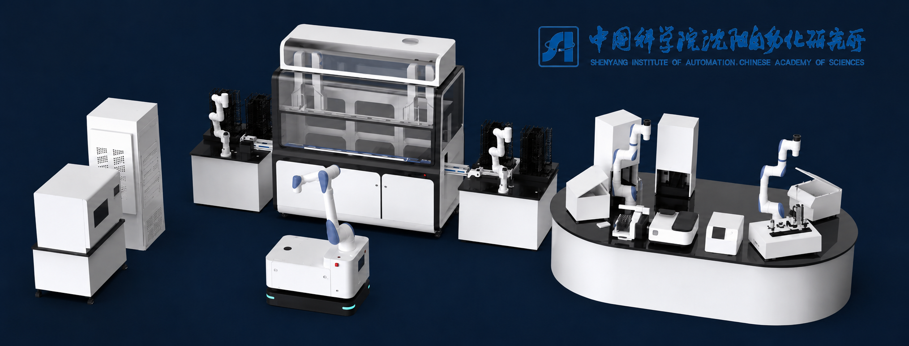
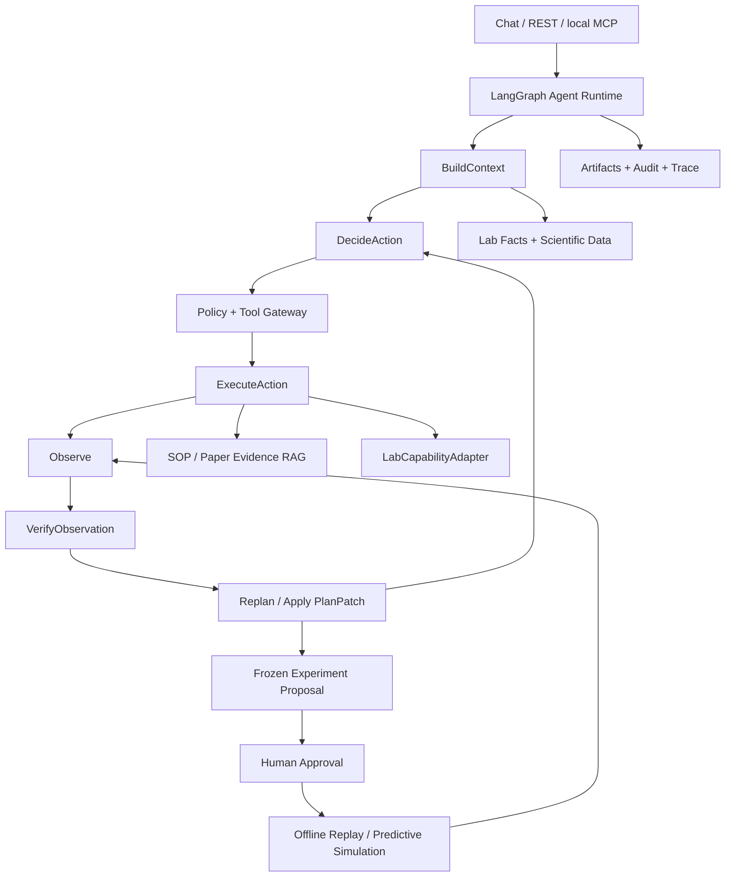
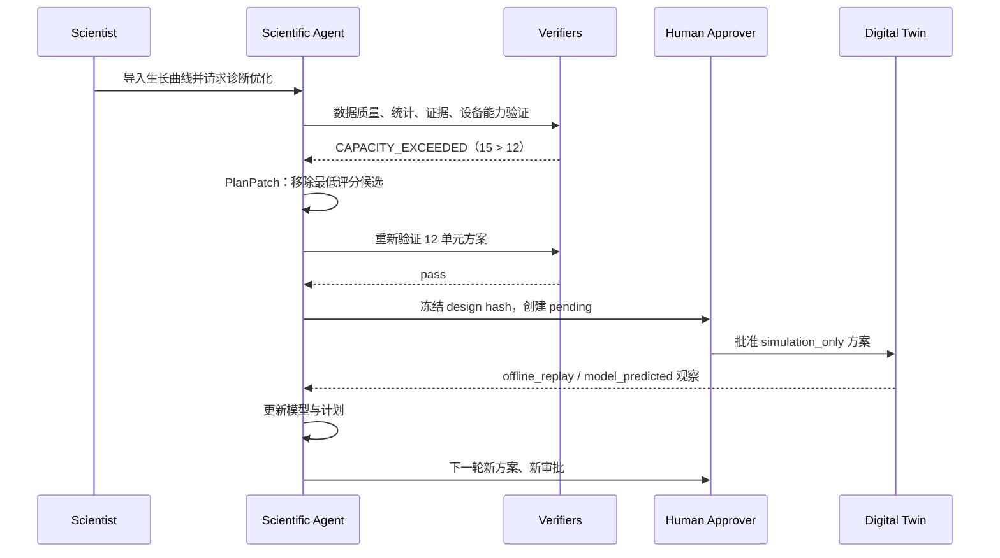

# 🧫 Algae Agent：面向微藻自驱动实验室的状态感知、异常诊断与实验优化 Agent

> **A safety-governed scientific agent for microalgae self-driving laboratories**

[](https://www.python.org/)
[](https://fastapi.tiangolo.com/)
[](https://github.com/langchain-ai/langgraph)
[](https://modelcontextprotocol.io/)
[](#-evaluation--verification--评测与验证)

<p align="center">
  
</p>

<p align="center">
  <em>Algae Agent 面向微藻自驱动实验室的自动化设备布局与数字孪生应用场景</em>
</p>

---

## 📖 Abstract / 项目摘要

**[中文]**

Algae Agent 是“面向绿色生物的 AI 智能化生化分析评价系统研制”中的微藻实验室 Agent 子系统。它持续维护菌株、培养批次、实验任务和设备能力状态，融合时序生长数据、环境因素、SOP 与论文证据，对生长异常进行候选原因诊断，生成并验证下一轮实验方案，并在安全策略和人工审批约束下推动数字孪生实验。

项目的核心不是让 LLM 自由调用更多工具，而是实现一个可审计的科学闭环：

```text
状态感知 → 异常检测 → 候选原因 → 证据验证 → 实验设计
→ 约束仿真 → PlanPatch 修补 → 人工审批 → 数字孪生
→ 结果反馈 → 下一轮优化
```

系统保留菌株管理、传代、RAG、邮件、审批、协议编译、设备仿真、Trace、Memory 和 Learning，并将这些能力重新组织为自驱动实验室的必要底座。

**[English]**

Algae Agent is a safety-governed scientific agent for microalgae self-driving laboratories. It combines time-series growth measurements, culture conditions, laboratory state, device capabilities, SOPs, and literature evidence to diagnose anomalous growth and propose constrained follow-up experiments. Every scientific run produces versioned goals, plans, observations, verification reports, and plan patches. Approved experiments execute only against explicitly labeled digital-twin adapters and feed their observations back into the same run.

> **Capability boundary:** the current system demonstrates a `simulation_only` closed loop. It does not claim physical robot execution, wet-lab validation, or scientific outcomes beyond the available data.

---

## 🎯 What Makes It an Agent? / 为什么它不是普通分析脚本

| Agent 能力 | 项目中的真实实现 | 解决的问题 |
| --- | --- | --- |
| 结构化目标 | `GoalContract` 固定指标、方向、约束、批次、循环数和 seed | 防止任务执行过程中目标漂移 |
| 动态计划 | 版本化 `ScientificPlanGraph` 与 `PlanPatch` | 补丁结构支持增加、替换、删除节点；当前闭环覆盖增加与替换路径 |
| 工具观察 | 数据质量、统计模型、RAG、设备适配器分别产生 `Observation` | 不用 LLM 自评替代外部验证 |
| 独立验证 | `VerificationReport` 输出 `pass/revise/clarify/block` | 把数值正确性、证据和可行性变成硬门禁 |
| 失败恢复 | 设备容量失败后修补实验设计并重新验证 | 证明 Replan 不只是预写成功分支 |
| 人在回路 | 冻结 design hash，创建 pending，每轮方案独立审批 | 计划改变后不能沿用旧授权 |
| 闭环反馈 | 批准后执行数字孪生，将新结果反馈给同一 scientific run | 让实验结果真正改变下一轮计划 |
| 可审计性 | Artifact version/hash、Agent Trace、角色和来源审计 | 能解释一次 run 为什么这样行动 |

项目有意采用**单 Orchestrator + Skills + 确定性 Verifiers**，而不是为了形式引入多智能体。当前挑战是事实、计划、验证和授权的一致性；单 Agent 更容易保证可恢复和可审计。

---

## 🧠🏗️ System Architecture / 系统架构



### Four State Spaces / 四层状态空间

```text
实验室事实层    strains / experiments / pending / workflow / lab_devices
科学数据层      scientific_datasets / culture_batches / measurements / virtual_results
知识证据层      SOP / papers / manuals / evidence citations
Agent 过程层    Goal / Plan / Observation / Verification / Patch / Trace
```

RAG 证据和数值测量严格分离：RAG 用于解释候选假设，结构化数据用于科学计算；两者都不能单独授权执行。

---

## 🔬 Scientific Closed Loop / 科学自主闭环

一次 `diagnose_and_optimize` 任务会执行以下过程：

1. 导入 CSV/XLSX，完成字段映射、公式、单位、重复时间点和数值校验。
2. 创建 `GoalContract` 和默认科学 DAG。
3. 计算最大 biomass、AUC、最大比生长速率、倍增时间和延滞期。
4. 检测数据质量异常、曲线异常和响应面残差异常。
5. 输出候选原因，并为保留假设检索 SOP/论文证据。
6. 使用 NumPy ridge 响应面和 200 次固定 seed bootstrap 评估候选条件。
7. 生成 4 个候选加 1 个对照、每组 3 个重复的首轮设计。
8. 默认 12 位设备拒绝 15 单元设计，Agent 生成 `PlanPatch`。
9. 修补为 3 个候选加 1 个对照，共 12 单元，并重新验证。
10. 冻结语义 design hash，等待 approver 审批。
11. 批准后运行 `OfflineReplayLabAdapter` 或 `PredictiveSimulationAdapter`。
12. 将明确标记来源的虚拟观察反馈给同一 run；下一轮方案重新审批。



---

## ✨ Key Features / 核心特性

### 1. Scientific Data & Diagnosis / 科学数据与异常诊断

- CSV/XLSX 导入，默认最大 10 MB；拒绝不安全扩展名和不可解析公式。
- 显式或自动字段映射；映射不唯一时返回 `mapping_required`，不猜测字段。
- 支持批次、重复、菌株、因素和单位；没有批次列时根据因素组合生成稳定 ID。
- 生长速率采用正值区间滑动对数线性拟合，点数不足时明确降级。
- 异常只能输出候选原因，禁止把数据关联写成已验证因果关系。

### 2. Evidence-Grounded Scientific Reasoning / 证据约束推理

- RAG 检索 SOP、论文和实验室文档，为候选假设提供引用。
- 数据关联、文献支持和替代解释排除共同决定候选支持程度。
- LLM 可以补充解释，但只有通过结构化验证的候选才能进入报告。
- RAG 保持只读，不能修改数据库、批准方案或触发设备。

### 3. Constraint-Aware Optimization / 约束感知实验优化

- 根据样本量在 linear、quadratic-main-effects 和 full quadratic/interactions 间降级。
- 因素标准化后进行 ridge 回归，固定 `lambda=1e-3`。
- 候选得分综合预测改进、不确定性、信息价值、已测条件距离和约束惩罚。
- 新观察会形成版本化 PlanPatch，而不是只进入预先写好的成功/失败分支。

### 4. Digital Twin & Adapter Boundary / 数字孪生与跨平台边界

统一的 `LabCapabilityAdapter` 接口：

```text
descriptor()
capabilities()
snapshot()
validate_design(design)
simulate_design(design)
compile_protocol(design)
```

当前实现：

- `OfflineReplayLabAdapter`：将 25 组条件按固定 seed 划分为 17 个可见条件和 8 个隐藏条件，批准后才释放匹配曲线。
- `PredictiveSimulationAdapter`：没有隐藏真值时生成模型预测，始终标记 `model_predicted`。
- Legacy subculture simulator：保留原传代仿真与协议闭环。


### 5. Safety, HITL & Audit / 安全、审批与审计

- `viewer / scientist / approver` 三级 API Key 权限。
- 未配置密钥时写操作拒绝，不存在匿名管理员回退。
- 设计 hash 被篡改、计划版本陈旧、实验条件重复或审批角色不足时阻断。
- 每一轮新方案单独审批，不继承上一轮授权。
- 所有虚拟结果保存 `offline_replay` 或 `model_predicted` 来源，不能冒充湿实验结果。
- CORS 默认仅允许本地 React 开发服务器与 Legacy Streamlit 地址。

### 6. Existing Laboratory Foundation / 保留的实验室底座

- 菌株管理与传代 Workflow
- Pending Approval 与 checkpoint resume
- 协议构建、验证、仿真和编译
- 邮件草稿、确认发送和通知
- Hybrid Evidence RAG
- Agent Trace、Agent Learning、用户长期 Memory 和 Eval
- React 统一控制台，以及保留用于兼容的 Streamlit Scientific Workbench

---

## 🔌 MCP Server / 本地 MCP 接口

项目提供本地 stdio `algae-lab` MCP Server。MCP 是受限客户端入口，不是新的执行后门；所有工具仍通过 Tool Gateway，并记录调用来源为 `mcp_local`。

### Resources

```text
algae://lab/state
algae://datasets/{dataset_id}
algae://scientific-runs/{run_id}
algae://devices
algae://traces/{agent_run_id}
```

### Tools

```text
datasets_list
growth_diagnosis_start
experiment_design_preview
experiment_proposal_request
```

MCP **不提供** `approve`、真实执行、任意数据库修改或硬件控制。

启动 MCP Server：

```bash
python scripts/run_algae_mcp.py
```

客户端配置示例：

```json
{
  "mcpServers": {
    "algae-lab": {
      "command": "python",
      "args": ["D:/algae_agent/scripts/run_algae_mcp.py"],
      "cwd": "D:/algae_agent"
    }
  }
}
```

---

## ⚙️🚀 Quick Start / 快速开始

下面按“配置 → 启动 → 验证”的顺序给出最短可运行路径。首次体验推荐 Docker；需要修改前后端代码时使用本地开发模式。

### 1. Docker 启动（推荐）

前置条件：已安装 Docker Desktop 或 Docker Engine，并启用 Docker Compose。

```powershell
git clone https://github.com/baichenL/algae_agent.git
cd algae_agent
Copy-Item .env.example .env
```

在 `.env` 中按需填写 `DEEPSEEK_API_KEY`，并替换 `ALGAE_API_KEYS_JSON` 中的示例密钥。不要把真实凭据提交到仓库。随后启动服务：

```powershell
docker compose up --build
```

默认 Compose 使用不可变的镜像代码、Docker named volume `algae-data`，并只监听
`127.0.0.1`。`ALGAE_FRONTEND_API_KEY` 必须与 `ALGAE_API_KEYS_JSON` 中配置的密钥一致；
需要允许其他主机访问时，再显式设置 `ALGAE_BIND_HOST=0.0.0.0` 并配置外围访问控制。

需要把工作区源码和 `./data` 挂载进容器进行本地开发时，显式叠加开发配置：

```powershell
docker compose -f docker-compose.yml -f docker-compose.dev.yml up --build
```

开发覆盖配置默认使用 `ALGAE_DEV_UID=0`、`ALGAE_DEV_GID=0`，以兼容 Windows
Docker Desktop 中由旧版 root 容器创建的 SQLite 文件；基础 Compose 镜像仍以非 root
用户运行。开发配置只补回 SQLite 兼容所需的 `DAC_OVERRIDE` 和 `FOWNER`；Linux 开发
环境可把这两个 UID/GID 值改为宿主用户的 `id -u` 和 `id -g`。

- React 统一控制台：<http://127.0.0.1:8000/app>
- API 文档：<http://127.0.0.1:8000/docs>
- Legacy Streamlit：<http://127.0.0.1:8501>

停止服务：

```powershell
docker compose down
```

### 2. 本地开发

前置条件：Python 3.11+、Node.js 20+、Corepack/pnpm。

安装 Python 依赖并创建本地配置：

```powershell
git clone https://github.com/baichenL/algae_agent.git
cd algae_agent
python -m venv .venv
.\.venv\Scripts\Activate.ps1
python -m pip install -r requirements.txt
Copy-Item .env.example .env
```

按 Docker 模式中的说明配置 `.env`，然后构建 React 前端并启动 FastAPI：

```powershell
corepack enable
Set-Location web
pnpm install --frozen-lockfile
pnpm build
Set-Location ..
python -m uvicorn app.main:app --host 127.0.0.1 --port 8000
```

- 统一控制台：<http://127.0.0.1:8000/app>
- API 文档：<http://127.0.0.1:8000/docs>
- V2 控制层：`/api/v2`；兼容接口继续保留在 `/api/v1`

### 3. React 热更新

保持 FastAPI 运行，在另一个 PowerShell 终端中启动 Vite：

```powershell
Set-Location web
pnpm install
pnpm dev
```

开发地址：<http://127.0.0.1:5173/app/>。Vite 会把 `/api` 代理到 `127.0.0.1:8000`；生产构建仍由 FastAPI 在 `/app` 同源托管。

如需单独运行 Legacy Streamlit：

```powershell
streamlit run frontend/app.py --server.port 8501
```

### 4. 离线演示与验证

以下入口不依赖在线 LLM，可用于验证关键工程路径：

```powershell
python scripts/run_project_demo.py
python scripts/run_self_driving_lab_demo.py
python scripts/run_scientific_eval.py
python -m pytest -q
Set-Location web
pnpm test
pnpm build
```

---

## 🖥️ Scientific Workbench / 科学工作台

Workbench 提供：

- CSV/XLSX 上传与字段映射
- 生长曲线、数据质量和异常批次查看
- Goal、Plan、Observation、Verifier、PlanPatch 时间线
- 候选假设—数据—文献引用对照
- 实验设计、设备能力、容量失败和自动修补展示
- Pending 审批与数字孪生结果
- 真实导入、offline replay 和 model predicted 明显来源标签

---

## 🧪 Evaluation & Verification / 评测与验证

### Full Test Suite / 全量测试

```bash
python -m pytest -q
```

当前工作区通过 `python -m pytest --collect-only -q` 可收集 **411** 个测试；实际通过状态以当前提交的完整测试运行或 CI 结果为准。

### Scientific Eval / 科学闭环评测

```bash
python scripts/run_scientific_eval.py
```

离线、无需在线 LLM 的当前结果：

| 指标 | 当前结果 | 评测边界 |
| --- | ---: | --- |
| 科学场景 | 31 / 31 passed | 数据质量、指标、诊断边界、补丁、安全和闭环 |
| Top-3 候选原因命中率 | 100% | 带标签的确定性异常用例 |
| 保留假设引用覆盖率 | 100% | Eval 临时构建的本地论文语料 |
| 约束满足与虚实隔离 | 100% | 12 位容量和 simulation provenance 用例 |
| Full-loop vs no-replan Recovery Gain | +100 pp | 容量超限故障场景 |
| Simple regret 改进 | 100% | 多固定 seed、17/8 已知二次响应面基准 |

这些是项目内部、可重复的工程 Eval，不等同于湿实验效果或通用科研能力评估。

### Complete Closed-Loop Demo / 完整闭环演示

```bash
python scripts/run_self_driving_lab_demo.py
```

Demo 会真实调用科学计算代码完成：

```text
导入 25 组曲线
→ 诊断与实验设计
→ 15 单元容量失败
→ PlanPatch 修补为 12 单元
→ 创建 pending
→ 模拟 approver 批准
→ offline replay
→ 结果反馈与重规划
→ 下一轮新 pending
→ 第二轮批准并结束
```

所有输出均为 `simulation_only`，不会修改真实硬件状态。

---

## 🌐 REST API Surface / 主要接口

### V2 Control Plane & User Memory

```text
POST   /api/v2/session/login
GET    /api/v2/dashboard
POST   /api/v2/assistant/conversations
POST   /api/v2/assistant/conversations/{conversation_id}/messages
GET    /api/v2/operations/{operation_id}
GET    /api/v2/runs/{run_id}
GET    /api/v2/approvals
POST   /api/v2/approvals/{approval_id}/decision
GET    /api/v2/memories
POST   /api/v2/memories
GET    /api/v2/memories/candidates
GET    /api/v2/memories/export
GET    /api/v2/memory-settings
PATCH  /api/v2/memory-settings
```

V2 写接口使用已认证浏览器会话与 CSRF 校验；Memory 接口始终按当前 principal 和 workspace 隔离。

### Scientific API

```text
POST /api/v1/scientific/datasets/import
GET  /api/v1/scientific/datasets
GET  /api/v1/scientific/datasets/{dataset_id}
POST /api/v1/scientific/runs
GET  /api/v1/scientific/runs/{run_id}
POST /api/v1/scientific/runs/{run_id}/proposal
GET  /api/v1/lab/devices
```

### Existing Agent & Laboratory API

```text
POST /api/v1/chat
GET  /api/v1/agent/runs/{agent_run_id}
GET  /api/v1/strain/list
GET  /api/v1/strain/pending
POST /api/v1/strain/confirm
POST /api/v1/workflow/simulations
POST /api/v1/rag/query
```

Chat 与 REST 调用同一个科学领域服务，不维护两套闭环逻辑。

---

## 📁 Repository Map / 项目结构

```text
app/
├── api/                         REST、V2 Assistant、Memory、RBAC 与审批接口
├── core/db/                     业务状态、科学数据、artifact 与 Memory Schema
├── mcp/                         本地 proposal-only MCP Server
├── services/
│   ├── agent_runtime/           LangGraph Runtime、Verifier、Replan、Trace、Resume
│   ├── context/                 Context Assembler、Profile 与预算裁剪
│   ├── scientific/              导入、分析、优化、Adapter 与自主闭环
│   ├── rag/                     只读 Hybrid Evidence RAG
│   ├── skills/                  Agent Skills 与工具边界
│   ├── protocols/               协议构建、hash、验证、仿真、编译
│   ├── workflows/               传代与审批恢复 Workflow
│   ├── memory/                  Agent 经验记忆兼容层
│   ├── user_memory/             用户级长期记忆、候选、检索与生命周期
│   └── learning/                Agent Review、Curator 与经验复用
└── tools/                       Tool Registry、Gateway 与科学工具

web/                             React + TypeScript 统一控制台
frontend/
├── app.py                       Streamlit 导航
└── scientific.py                Legacy Scientific Workbench

scripts/
├── run_project_demo.py          DB、RAG、Workflow 与 Trace 工程演示
├── run_self_driving_lab_demo.py 完整两轮数字孪生 Demo
├── run_scientific_eval.py        科学闭环与消融 Eval
├── run_agent_eval.py             原 Agent Runtime Eval
└── run_algae_mcp.py              MCP stdio 入口

docs/                            01–12 主题文档与 Design_idea 深度设计分析
tests/                           Runtime、RAG、Workflow、科学闭环和安全测试
```

---

## 📚 Documentation / 文档

- [新项目总览：微藻自驱动实验室 Agent](docs/01_new_project_overview.md)
- [原项目总览与改版提示](docs/01_project_overview.md)
- [Runtime Graph](docs/02_runtime_graph.md)
- [Decision 与科学任务路由](docs/03_decision.md)
- [Context Engineering](docs/04_context.md)
- [Context 设计分析](docs/Design_idea/02_context_design_analysis.md)
- [Policy、Tools 与 Pending](docs/05_policy_tools_pending.md)
- [Memory](docs/06_memory.md)
- [Memory 设计分析](docs/Design_idea/03_memory_design_analysis.md)
- [Workflow](docs/07_workflow.md)
- [Hybrid Evidence RAG](docs/08_rag.md)
- [Database、Audit 与 Trace](docs/09_database_audit_trace.md)
- [Email 与 Notifications](docs/10_email_notifications.md)
- [Frontend、API 与 Testing](docs/11_frontend_api_testing.md)
- [Eval 与 Demo](docs/12_eval_demo.md)

---

## 🔒 Current Boundaries / 当前能力边界

| 已实现 | 尚未实现或不在本轮范围 |
| --- | --- |
| 单 Agent 科学闭环与动态 PlanPatch | 多智能体科研协作 |
| Offline replay 与 predictive simulation | 真实机器人/培养设备适配 |
| 本地 stdio MCP | 远程 HTTP MCP |
| React 统一控制台与 Legacy Streamlit Workbench | 原生桌面端或移动端客户端 |
| API Key 三级角色 | 完整 OAuth/OIDC/组织权限系统 |
| 用户长期 Memory 的 Schema、API、设置页与 Shadow 流水线 | 生产流量灰度；默认仍为 `USER_MEMORY_ENABLED=false` |
| Windows 与 Ubuntu 核心 CI | 对具体硬件 SDK 的跨平台验证 |
| 内部科学 Eval | 外部湿实验和跨实验室验证 |

项目只在“状态感知—独立验证—动态修补—审批—仿真反馈”这一自主闭环维度完成了定向工程实现。

---

## ⚠️ Responsible Use / 使用说明

- 本项目用于实验室 Agent 工程研究和数字孪生验证。
- 未经人工审核，不应将生成方案直接用于真实培养或硬件执行。
- `offline_replay` 和 `model_predicted` 结果不能作为湿实验事实引用。
- 接入真实设备前，必须补充设备级安全约束、急停、权限、校准和责任人流程。
